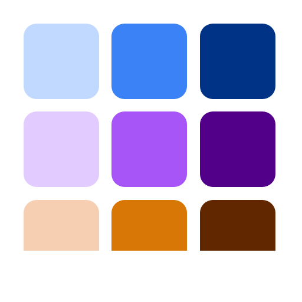

# A Guide to Color Palettes

This guide explains **how** and **why** `Color.Palette` generates palettes the way it does, the research and industry practice behind each choice, and — most importantly — **which algorithm to reach for given the problem in front of you**.

## What a palette actually is

In everyday speech, a "palette" is just "a collection of colours that go together". In a design system, the word carries more structure. A palette is a *named, parameterised, programmatically-regenerable set of colours derived from a small number of inputs*, shaped so that the resulting colours fit into the roles that a UI framework expects — backgrounds, text, borders, interactive states, status indicators, and so on.

That definition carries three consequences that drive every choice below:

1. **Palettes are derived, not curated.** A good palette is computed from a seed. If you swap the seed, the whole palette regenerates consistently. You don't pick each shade by eye.
2. **Palettes serve roles.** A shade isn't just "shade #7 of blue" — it's "the colour used for default body text on a light surface". Different palette algorithms are optimised for different role structures.
3. **Palettes have to cope with the gamut.** The sRGB cube is small. Many mathematically ideal palettes fall partly outside it and have to be gamut-mapped before they're usable on a screen.

## Background: why perceptually uniform spaces matter

Early palette tools (including most 2010-era CSS preprocessors) built tonal scales by varying **L in HSL**. This produces visibly wrong results. HSL's lightness coordinate is perceptually lumpy: a 10% lightness step around yellow looks enormous, while a 10% step around blue is barely visible. Scales look uneven. Mid-tones of warm hues appear washed out while cool mid-tones look fine. The whole palette feels inconsistent.

The fix, adopted more or less simultaneously across the industry in the early 2020s, is to generate palettes in a **perceptually uniform space** — one where equal coordinate steps correspond to equal perceived differences:

* **CIE Lab / LCh** — the original attempt (1976). Better than sRGB for lightness, but the hue spacing is still not uniform; shifts in the blue-purple region are famously off.
* **Oklab / Oklch** — Björn Ottosson's 2020 refinement. Fixed most of Lab's remaining issues. Now the de facto standard for web palette generation: Tailwind v4, Radix Colors, Culori, and most modern design-system tooling operate in Oklch.
* **CAM16 / HCT** — Material Design 3's choice. More rigorous than Oklab (it models chromatic adaptation and viewing conditions), at the cost of more math and a harder-to-inspect representation. Produces results very close to Oklch for typical sRGB content.

`Color.Palette` works in **Oklch**. This matches the majority of modern web tooling, is simple to inspect and debug, and gives indistinguishable results from HCT for the content volumes a design system actually handles.

## The three algorithms

After surveying the major design systems (Material Design 3, Tailwind, Radix Colors, Adobe Leonardo, IBM Carbon, Open Color, Atlassian ADG) and tooling libraries (`chroma.js`, `culori`, `material-color-utilities`), palette generation clusters into a small number of recognisable patterns. `Color.Palette` ships the three that cover the vast majority of web use cases.

### 1. Tonal scale — `Color.Palette.Tonal`

**What it does.** From one seed colour, produce N shades of *that hue* spread from light to dark along a perceptually uniform curve. This is what `Tailwind`'s `blue-50` through `blue-950` are. It is the single most commonly requested palette shape in modern CSS, and it's what every design-token tool ultimately speaks.

**How it's built.**

1. Convert the seed to Oklch.
2. Sweep lightness `L` across the stops, from a light anchor (near-white, e.g. `0.98`) to a dark anchor (near-black, e.g. `0.15`).
3. **Damp the chroma at the extremes** with a `sin(π · L)` curve. This is the critical move. Light tints near white and dark shades near black cannot carry as much chroma as a mid-tone — they fall outside sRGB, look muddy, or blow past the gamut. Damping them back to zero at `L = 0` and `L = 1` is what makes modern scales look polished instead of looking like someone lerped in HSL.
4. Optionally apply a small **hue drift** — warm toward yellow at the light end, cool toward blue at the dark end. This matches how the human visual system perceives lightness (the *Hunt effect*) and is what gives Radix and the newer Tailwind scales their slightly "natural" feel. Off by default.
5. **Snap-to-seed.** Find the generated stop whose lightness is closest to the seed, and replace that stop with the seed itself. This means if a designer hands you a brand colour that's expected to live at step 500, step 500 really is exactly that colour — not an algorithmic approximation a few ΔE away.
6. **Gamut-map** each stop into sRGB via the CSS Color 4 binary-search algorithm (already implemented in `Color.Gamut`).

**When to use it.**

* You need a Tailwind-style scale: `bg-primary-50`, `bg-primary-100`, …, `bg-primary-950`.
* You have one brand colour and you need ten shades of it.
* You're building a component library and you want to expose exactly one design token per shade.
* You're matching an existing design system's step numbering (50/100/…/950 is near-universal now).

**When it's the wrong choice.**

* You need to handle more than one seed at a time — use `Color.Palette.theme/2` so you get a coordinated set of scales instead of N independent ones that might clash.
* You need specific contrast guarantees on each step — Tonal gives you visually even lightnesses, which is not the same as contrastually even shades. Use `Color.Palette.contrast/2`.

### 2. Theme — `Color.Palette.Theme`

**What it does.** From one seed, produce a **complete design-system theme**: five coordinated tonal scales covering every role a UI framework needs — primary, secondary, tertiary, neutral, and neutral-variant — plus a mapping from Material Design 3's symbolic role tokens (`:primary`, `:on_primary`, `:surface`, `:outline`, etc.) to specific stops in those scales.

This is the algorithm behind Google's Material Design 3 and its Material You dynamic theming. The whole point is that one input colour becomes ~65 output colours that are internally consistent: no matter which pair you juxtapose, they always look like they belong to the same theme.

**How it's built.**

1. The **primary** scale is a Tonal scale of the seed — its hue, full chroma.
2. The **secondary** scale is the same hue, chroma reduced (default ⅓). It's a muted sibling, used for less-prominent accents and supporting UI.
3. The **tertiary** scale is the hue rotated (default +60°) at full chroma. It's a complementary accent, used for secondary brand moments, highlights, and contrast-of-theme situations.
4. The **neutral** scale is the seed's hue at very low chroma (default 0.02 in Oklch). This isn't pure grey — it's a slightly tinted grey that matches the theme. Used for surfaces, backgrounds, and body text.
5. The **neutral-variant** scale is the same hue at slightly higher chroma (default 0.04). Used for outlines and dividers — things that need to be visible but not loud.
6. Each of the five scales uses Material 3's 13-stop tone system (`[0, 10, 20, …, 90, 95, 99, 100]`) so that `Theme.role(theme, :primary)` (= primary 40) and `Theme.role(theme, :on_primary)` (= primary 100) are guaranteed to contrast correctly.
7. `Theme.role/3` takes a `:scheme` option (`:light` or `:dark`) that flips which tone each role maps to, so the same theme struct serves both schemes.

**When to use it.**

* You're building a complete application or design system and you need more than one accent colour.
* You want to support light and dark modes from a single configuration.
* You want Material-style role tokens — `on_primary_container`, `surface_variant`, `outline` — ready to plug into CSS custom properties.
* You're implementing dynamic theming (user picks a seed, the whole app re-colours).

**When it's the wrong choice.**

* You only need one accent colour — Theme generates four extras you'll never use. Reach for `tonal/2` instead.
* Your design system has its own role vocabulary that isn't Material's — you can still use Theme as an engine, but you'll be adapting its output rather than consuming it directly.
* You need stops at specific contrast ratios — the Material tone numbers (0..100) are a tone-space convention, not a contrast-space convention. Use `contrast/2`.

### 3. Contrast-targeted — `Color.Palette.Contrast`

**What it does.** From a seed, a background colour, and a list of target contrast ratios, produce shades that hit those contrast targets *exactly* against the background.

This is what Adobe's [Leonardo](https://leonardocolor.io/) tool does, and it is increasingly how accessibility-conscious design systems generate component-state colours. The core insight: "visually even" lightness steps (what Tonal produces) are not the same as "contrastually even" steps. If your brand blue is at `L ≈ 0.5` and you need a variant that contrasts exactly 4.5:1 against white for AA-compliant body text, Tonal won't hand you one — Contrast will.

**How it's built.**

1. Convert the seed to Oklch. Hold hue and chroma.
2. For each target contrast ratio, **binary search** over Oklch `L ∈ [0, 1]`. Contrast is monotonic in lightness (for a fixed hue and chroma against a fixed background), so 24 iterations converge to sub-0.01 precision.
3. Probe both directions (lighter than background, darker than background) and keep the one that reaches the target.
4. If the seed's hue + chroma simply cannot reach the requested ratio — e.g. you asked for 21:1 against white with a seed that has significant chroma — the stop is flagged as `:unreachable` rather than silently returning the nearest available value. **Honest failure is a feature here.**
5. Gamut-map each generated stop into sRGB.

Contrast supports two metrics:

* `:wcag` — WCAG 2.x contrast ratios, typically in `[1.0, 21.0]`. The default targets are `[1.25, 1.5, 2.0, 3.0, 4.5, 7.0, 10.0, 15.0]`, covering "barely visible" through AAA large text.
* `:apca` — APCA W3 0.1.9 Lc values (a perception-based metric being considered for WCAG 3). Targets typically in `[15, 108]`. Defaults are `[15, 30, 45, 60, 75, 90]`.

**When to use it.**

* You need component states — resting, hover, active, focus, disabled — that all meet a specific contrast requirement.
* You're generating text shades that must pass AA (4.5:1) or AAA (7:1) on a known surface.
* You're auditing an existing palette and you want to know whether each step actually hits the ratio it claims to.
* You're implementing APCA-driven typography where Lc values are the design vocabulary.

**When it's the wrong choice.**

* You want a visually uniform *appearance* — contrast-targeted scales look uneven because they are optimising for a different variable. Lightness jumps between steps will vary.
* You don't have a fixed background — a contrast-targeted scale is only meaningful against the specific surface it was generated for.
* You're designing for print, packaging, or any medium where the final viewing conditions aren't known. Contrast metrics assume screen rendering.

## Choosing an algorithm

Start with what *kind of answer* you need:

| You need… | Use |
|---|---|
| Ten shades of my brand blue, keyed 50–950 | `tonal/2` |
| A complete light/dark theme from one seed | `theme/2` |
| Component states that pass AA against white | `contrast/2` with `metric: :wcag` |
| Text hierarchy driven by APCA Lc values | `contrast/2` with `metric: :apca` |
| Many accent colours that look like siblings | `theme/2` and use `:primary`, `:secondary`, `:tertiary` |
| The exact stops Tailwind produces for a custom hue | `tonal/2` |
| Colour-picker tool output | `tonal/2` per user input |
| Status / semantic colours (success, warning, error, info) | Four independent `tonal/2` calls with distinct seeds |
| Dynamic theming based on a hero image's dominant colour | `theme/2` (extract dominant, feed as seed) |

If you're not sure, the decision tree is:

1. **Do you need more than one seed?** Yes → `theme/2`. No → continue.
2. **Do the stops need to guarantee contrast against a known background?** Yes → `contrast/2`. No → `tonal/2`.

## Practical notes

### Picking a seed

* Both `tonal/2` and `theme/2` snap the seed to the nearest stop, so the seed is preserved exactly. If you need it at a *specific* stop (always 500, say), generate first and then check `palette.seed_stop` — if it's not where you want, nudge the seed's lightness.
* Mid-tone seeds (Oklch L around 0.55–0.65) produce the most balanced scales. Very light or very dark seeds will produce scales where most of the action is on one side of the seed.

### Chroma

* Over-saturated seeds (e.g. CSS `red`, `lime`) produce scales where the light and mid tints look fine but the dark end has to gamut-map aggressively. The chroma damping mostly hides this, but don't expect Radix-level polish unless you choose your seed carefully.
* Low-chroma seeds produce near-neutral scales. This is a legitimate use case (greys tinted by brand), not a bug.

### Hue drift

* Default off in `tonal/2`. Turn it on (`hue_drift: true`) when you want a more "designed" feel at the cost of a harder-to-predict output.
* Don't turn it on inside `theme/2` — you'll end up with scales that drift in different directions and the theme cohesion suffers.

### Unreachable contrast targets

* When `contrast/2` returns `:unreachable`, the correct response is usually to lower the target or accept a larger seed deviation. Don't silently substitute a close-enough colour — it defeats the purpose of the algorithm.
* Highly-saturated seeds reach lower maximum contrasts than near-neutral seeds. If you need very high contrast (> 15:1), consider using a near-neutral seed and placing the brand colour at a lower-contrast stop where it's still usable.

### Gamut mapping

* All three algorithms gamut-map into sRGB by default. If you're targeting Display P3 or Rec. 2020, pass `gamut: :P3` or `gamut: :Rec2020` and the extra chroma headroom will be used automatically.
* Gamut mapping uses the CSS Color 4 Oklch binary-search method, which preserves hue and lightness at the cost of reducing chroma. This is almost always the right trade.

## Worked example

Building a tokenised theme for a light/dark web app from a single brand colour:

```elixir
brand = "#3b82f6"

theme = Color.Palette.theme(brand)

# CSS custom properties for light scheme
css = """
:root {
  --primary: #{Color.to_hex(Color.Palette.Theme.role(theme, :primary) |> elem(1))};
  --on-primary: #{Color.to_hex(Color.Palette.Theme.role(theme, :on_primary) |> elem(1))};
  --surface: #{Color.to_hex(Color.Palette.Theme.role(theme, :surface) |> elem(1))};
  --on-surface: #{Color.to_hex(Color.Palette.Theme.role(theme, :on_surface) |> elem(1))};
  --outline: #{Color.to_hex(Color.Palette.Theme.role(theme, :outline) |> elem(1))};
}

[data-theme="dark"] {
  --primary: #{Color.to_hex(Color.Palette.Theme.role(theme, :primary, scheme: :dark) |> elem(1))};
  --on-primary: #{Color.to_hex(Color.Palette.Theme.role(theme, :on_primary, scheme: :dark) |> elem(1))};
  --surface: #{Color.to_hex(Color.Palette.Theme.role(theme, :surface, scheme: :dark) |> elem(1))};
  --on-surface: #{Color.to_hex(Color.Palette.Theme.role(theme, :on_surface, scheme: :dark) |> elem(1))};
  --outline: #{Color.to_hex(Color.Palette.Theme.role(theme, :outline, scheme: :dark) |> elem(1))};
}
"""
```

Changing `brand` regenerates the entire theme. Swap it to `"#ec4899"` and you have a pink app; swap it to `"#059669"` and you have a green app; the role structure and contrast relationships are unchanged.

## Design tokens (W3C DTCG)

All three palette types export to the W3C [Design Tokens Community Group](https://www.designtokens.org/) color format (2025.10 draft), so palettes can be consumed by Style Dictionary, Figma, Penpot, and any other tool that speaks DTCG.

```elixir
palette = Color.Palette.tonal("#3b82f6", name: "blue")

tokens = Color.Palette.Tonal.to_tokens(palette)
# => %{
#      "blue" => %{
#        "500" => %{"$type" => "color", "$value" => %{"colorSpace" => "oklch", ...}},
#        ...
#      }
#    }

json = :json.encode(tokens) |> IO.iodata_to_binary()
File.write!("tokens.json", json)
```

Themes export the five sub-palettes under `"palette"` plus Material 3 role tokens as **DTCG aliases** pointing at the underlying stops — tools that resolve aliases get both the raw palette and the semantic role vocabulary:

```elixir
theme = Color.Palette.theme("#3b82f6")
tokens = Color.Palette.Theme.to_tokens(theme, scheme: :light)

tokens["palette"]["primary"]["40"]
# => %{"$type" => "color", "$value" => %{"colorSpace" => "oklch", ...}}

tokens["role"]["primary"]
# => %{"$type" => "color", "$value" => "{palette.primary.40}"}
```

Contrast palettes emit one token per target. Unreachable stops are preserved with a `null` `$value` and an `$extensions.color.reason` field, so consumers can distinguish "excluded by filter" from "mathematically impossible".

The `Color.DesignTokens` module handles the low-level encode/decode for individual colours across all 14 DTCG-supported colour spaces — see its docs for the full list.

**Default encoding space is Oklch** (richest information, no gamut loss), with a `"hex"` fallback always present for tools that don't yet grok Oklab / Oklch. Override via the `:space` option to `to_tokens/2` for narrower toolchains.

**Alias resolution is out of scope for v1** — the decoder returns `:alias_not_resolved` if you hand it a `"{palette.blue.500}"` string. Resolve aliases in the caller where you have the full token tree.

**Modes** (DTCG's light/dark bundling) are not yet emitted. For now, call `Theme.to_tokens/2` with `scheme: :light` and `scheme: :dark` and save two files.

## Aside: the library's own logo



The logo you see on hexdocs and GitHub was produced by this library. It's a 3×3 grid of nine swatches — three hues (blue, violet, amber) across three tones (light, mid, dark) — all generated by `Color.Palette.Tonal`.

The generator code is essentially this:

```elixir
seeds = ["#3b82f6", "#a855f7", "#d97706"]
stops = [300, 500, 700]

for seed <- seeds do
  Color.Palette.tonal(seed,
    stops: stops,
    light_anchor: 0.88,
    dark_anchor: 0.35
  )
end
```

That produces the nine hex values. An HTML page with a CSS grid renders them at 512×512, and headless Chrome takes a screenshot. No external design tool, no hand-picked colours, no Figma file. The logo is literally output from the library applied to itself.

A few things worth noting from doing this:

* **Narrow anchors matter.** The defaults (`light_anchor: 0.98, dark_anchor: 0.15`) produced near-white and near-black swatches at the 300 and 700 stops — technically correct but visually dim. Tightening to `0.88` / `0.35` kept every swatch clearly in its hue family.
* **Seed lightness shows up.** The amber was originally `#f59e0b`, which has Oklch lightness around 0.78. With the tightened anchors, that's already past the lightest stop, so the snap-to-seed behaviour landed the seed at position 300 and pushed the "mid" and "dark" stops much darker than the other rows. Swapping to `#d97706` (L ≈ 0.62) — a visually comparable amber — put it at the centre stop instead and the three rows came out balanced. This is exactly the caveat the *Picking a seed* section above warns about, caught in our own dogfood.
* **Chroma damping did its job invisibly.** None of the nine swatches needed gamut clipping; the `sin(π·L)` damping in `Color.Palette.Tonal` kept every stop safely inside sRGB without us having to think about it.

The whole process — write `guides/palettes.md`, realise we need a logo, generate it with the library, save it, commit — was a small end-to-end demo of why `Color.Palette` exists. Turns out the best way to verify a palette library is to *use it on your own artefacts*.

## Further reading

* Ottosson, B. (2020). *[A perceptual color space for image processing](https://bottosson.github.io/posts/oklab/)*. The Oklab paper.
* Google (2021). *[Material Design 3: Color system](https://m3.material.io/styles/color/system/overview)*. The source of the role tokens.
* Stefanov, L. (2022). *[Radix Colors](https://www.radix-ui.com/colors)*. Detailed write-up on hue drift, chroma at the extremes, and designer-curated tone curves.
* Adobe (2021). *[Leonardo](https://leonardocolor.io/)*. The original contrast-targeted palette generator.
* Somers, A. (2024). *[APCA contrast](https://github.com/Myndex/apca-w3)*. Perception-based contrast metric.
