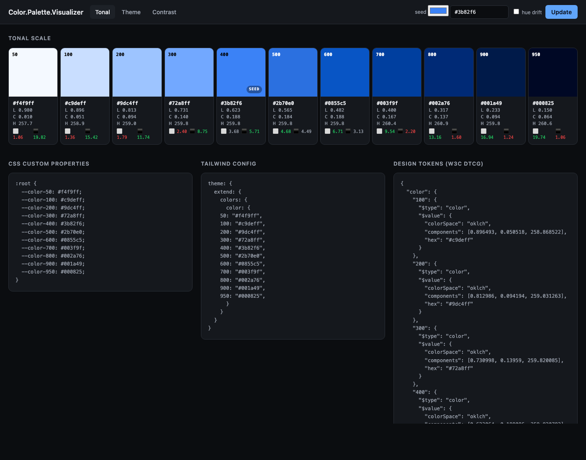
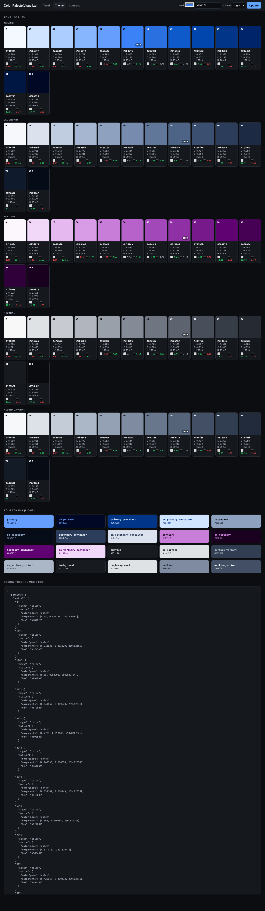
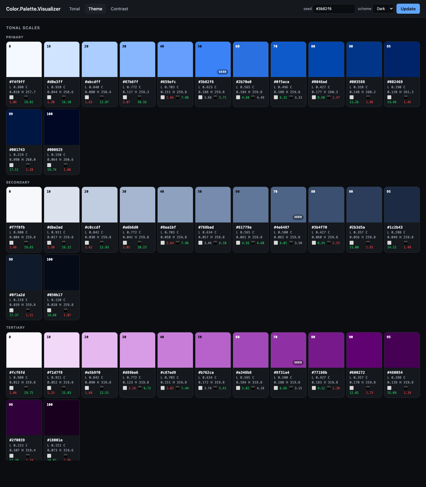
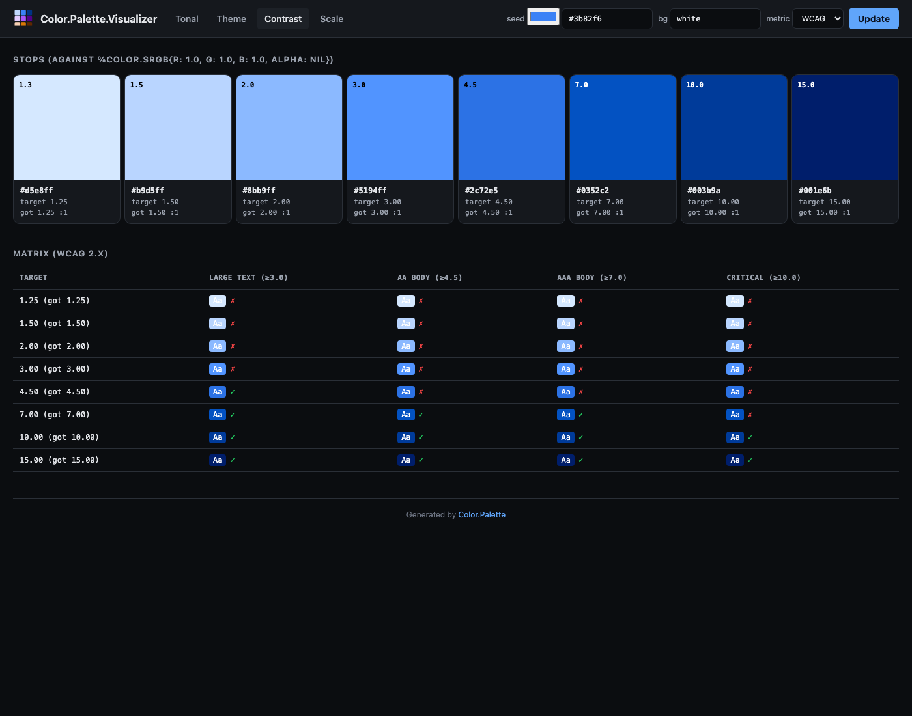
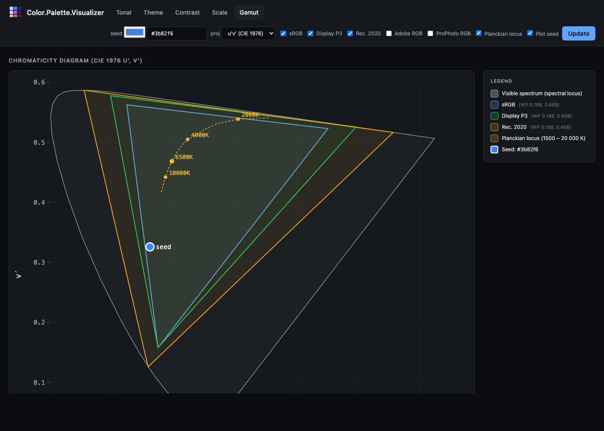
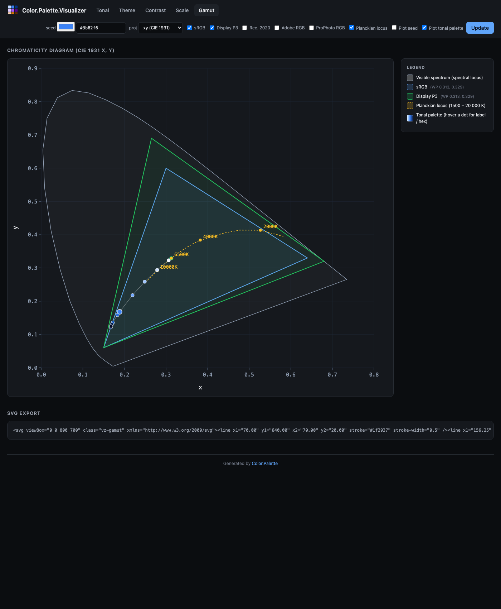
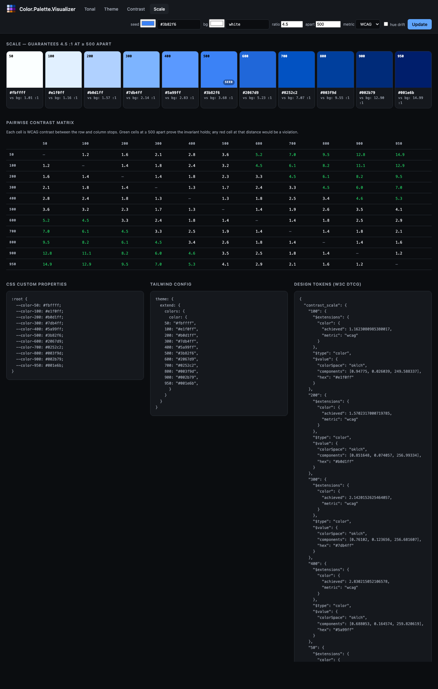

# Using the Palette Visualizer

`Color.Palette.Visualizer` is a small Plug-based web UI for previewing the palettes produced by `Color.Palette`. It runs standalone during development or mounts inside an existing Phoenix / Plug app. Every input lives in the URL — share a URL and you've shared the palette.

The visualizer is modelled on three widely-referenced sites, one per palette algorithm — [UI Colors](https://uicolors.app/generate) for Tonal, [Material Theme Builder](https://material-foundation.github.io/material-theme-builder/) for Theme, and [Adobe Leonardo](https://leonardocolor.io/) for Contrast. The Scale tab covers the fourth algorithm — contrast-constrained tonal scales, inspired by Matt Ström-Awn's [*Generating colour palettes with math*](https://mattstromawn.com/writing/generating-color-palettes/). See the [palette guide](palettes.md) for background on the four algorithms themselves.

## Install and run

The visualizer is opt-in. The core `color` library has zero runtime dependencies; pulling in `plug` and `bandit` is only required if you actually use the visualizer. Add both to your project's deps:

```elixir
# mix.exs
def deps do
  [
    {:color, "~> 0.4"},
    {:plug, "~> 1.15"},
    {:bandit, "~> 1.5"}
  ]
end
```

### Standalone (development)

```elixir
iex -S mix
iex> Color.Palette.Visualizer.Standalone.start(port: 4001)
# {:ok, #PID<0.xxx.0>}
# Open http://localhost:4001
```

### Mounted inside a Phoenix router

```elixir
# lib/my_app_web/router.ex
forward "/palette", Color.Palette.Visualizer
```

Mount path is arbitrary. The visualizer reads `conn.script_name` so links resolve correctly whether mounted at `/`, `/palette`, or anywhere else.

### Mounted inside a plain Plug pipeline

```elixir
defmodule MyApp.Router do
  use Plug.Router
  plug :match
  plug :dispatch

  forward "/palette", to: Color.Palette.Visualizer
end
```

### As a supervised child

```elixir
# For a Phoenix app that wants the visualizer running alongside on a second port
children = [
  # ... other children ...
  {Color.Palette.Visualizer.Standalone, port: 4001}
]
Supervisor.start_link(children, strategy: :one_for_one)
```

## The views

The visualizer ships seven views: `/tonal`, `/theme`, `/contrast`, `/scale`, `/gamut`, `/sort`, and `/spectrum`. The first five all start from a seed colour; the last two start from a free-form list of colours pasted into a textarea. All views share one header: a tab bar, the relevant input (seed picker or textarea), any view-specific options, and a submit button. Pages are fully server-rendered HTML — no JavaScript.

The seed input is actually **two** controls side-by-side: a native `<input type="color">` and a free-text field. Click the swatch to open your OS's colour picker; or type `rebeccapurple`, `oklch(0.7 0.15 180)`, or any other CSS colour syntax in the text field. On submit the server prefers the text field if you changed it (i.e. its value differs from what the picker was initialised to), otherwise it uses the picker's value. The picker pre-fills with the resolved hex of whatever seed is currently in the URL, so `?seed=rebeccapurple` opens the picker on `#663399`.

### Tonal — one seed, N shades



**URL.** `/tonal?seed=%233b82f6&hue_drift=0`

**What it shows.** Eleven swatches (Tailwind's 50–950 stops) laid out in a row. Under each swatch: the hex, the OKLCH coordinates, and a two-cell contrast readout — contrast-against-white and contrast-against-black, coloured green when the ratio passes 4.5:1, amber at 3:1+, red below. The swatch that holds the seed gets a "SEED" badge so you can see exactly where it landed on the scale.

Below the strip: a **CSS custom properties** block ready to paste into a stylesheet, and a **Tailwind config** block shaped for `theme.extend.colors`.

**Options.**
* `seed` — any value `Color.new/1` accepts (hex, CSS named colour, `oklch(...)`, etc.).
* `hue_drift` — toggles the Hunt-effect hue drift (warm at the light end, cool at the dark end).

### Theme — five coordinated scales + role tokens



**URL.** `/theme?seed=%233b82f6&scheme=light`

**What it shows.** Five rows, one per sub-palette (primary / secondary / tertiary / neutral / neutral-variant), each showing the full 13-stop Material 3 tone scale. Below those, a grid of every Material 3 role token (`primary`, `on_primary`, `surface`, `surface_variant`, `outline`, etc.) rendered as a card — the card's background is the role's colour and the card's text is its paired `on_*` role so you can see the intended foreground / background pairing together at a glance.

**Options.**
* `seed` — seed colour.
* `scheme` — `light` or `dark`. Flips which stop each role maps to (e.g. `:primary` is tone 40 in light, tone 80 in dark).

The dark scheme shows the same seed re-applied for a dark-UI theme:



### Contrast — target ratios and a pass/fail matrix



**URL.** `/contrast?seed=%233b82f6&background=white&metric=wcag`

**What it shows.** For each target contrast ratio (WCAG defaults: 1.25, 1.5, 2, 3, 4.5, 7, 10, 15), a swatch whose colour was binary-searched in Oklch lightness until it hits that exact ratio against the chosen background. The target and the ratio actually achieved are both printed on the card so any snap-to-precision drift is visible.

Below the swatches: a **matrix**. One row per generated stop, one column per common text-size pass threshold (WCAG: Large 3:1, AA 4.5:1, AAA 7:1, Critical 10:1 — APCA: 45, 60, 75, 90). Each cell shows a mini "Aa" preview in the stop colour on the background, plus a ✓ / ✗ for whether that stop passes the column's threshold. Unreachable targets (the seed's hue and chroma physically can't hit the requested ratio against this background) are marked with a struck-through em-dash and left empty rather than silently falling back to something close.

**Options.**
* `seed` — seed colour.
* `background` — the colour to measure contrast against. Default `white`; try `black` for dark-mode planning.
* `metric` — `wcag` (default) or `apca`.

### Gamut — chromaticity diagram



**URL.** `/gamut?projection=uv&gamut[]=SRGB&gamut[]=P3_D65&planckian=1&overlay_seed=1`

**What it shows.** The classic **chromaticity horseshoe** — the boundary of human-visible colour — with coloured triangles overlaid for each RGB working space. Every triangle's white point is marked with a filled circle in the same colour. Optionally, the **Planckian locus** (the curve of blackbody chromaticities from 1500 K to 20 000 K) is drawn as a dashed gold line with labelled CCT annotations at 2000, 2700, 4000, 6500, and 10 000 K. The current seed colour is plotted as a white-bordered dot labelled "seed", so you can see which of the working spaces actually contain it.

The legend on the right lists every rendered triangle with its white-point coordinates, and the Planckian and seed overlays when they're active.

**Options.**
* `projection` — `uv` (CIE 1976 u′v′, default) or `xy` (CIE 1931). u′v′ is perceptually more uniform and what modern references use; xy is the textbook default.
* `gamut[]` — zero or more of `SRGB`, `P3_D65`, `Rec2020`, `Adobe`, `ProPhoto`. Each renders as an overlaid triangle.
* `planckian` — checkbox, toggles the Planckian locus.
* `overlay_seed` — checkbox, plots the seed as a large white-bordered dot.
* `overlay_palette` — checkbox, plots every stop of the tonal palette generated from the seed as a chain of coloured dots connected by a thin track. Each dot is hoverable for its stop label and hex. Useful for verifying that the entire palette lives inside a target gamut.
* `seed` — the colour whose chromaticity to plot.

Below the diagram there's an **SVG export** block containing the raw SVG markup — copy it straight into a design doc, blog post, or slide deck.

The xy projection looks like this — note how much more green and how much less blue there is compared to u′v′:



### Scale — contrast-constrained tonal scale



**URL.** `/scale?seed=%233b82f6&background=white&ratio=4.5&apart=500&metric=wcag`

**What it shows.** A Tailwind-style numeric scale (50–950) where **any two stops whose labels differ by at least `apart` are guaranteed to satisfy at least `ratio` contrast against each other**. The header notes the guarantee in plain English ("guarantees 4.5 : 1 at ≥ 500 apart"). Below the scale, a **pairwise contrast matrix** shows every stop-against-every-stop contrast — green cells at or past the `apart` threshold confirm the invariant visually, any red cell at that distance would be a violation. The three-column export block at the bottom provides CSS custom properties, Tailwind config, and W3C DTCG Design Tokens (including the achieved-vs-background ratio in each token's `$extensions`).

**Options.**
* `seed` — seed colour.
* `background` — the colour the contrast is measured against. Default `white`.
* `ratio` — the contrast threshold that distances ≥ `apart` must exceed. Default `4.5`.
* `apart` — the minimum label distance that triggers the contrast guarantee. Default `500`.
* `metric` — `wcag` (default) or `apca`. For APCA, `ratio` is interpreted as an Lc value (typical targets 45–90).
* `hue_drift` — enables the paper's Bezold-Brücke compensation. Off by default.

### Sort — perceptually-ordered swatch strip from a free-form list

**URL.** `/sort?strategy=hue_lightness&hue_origin=15&grays=before`

**What it shows.** A textarea where you paste a list of colours (one per line; any form `Color.new/1` accepts — hex, CSS named, `oklch(...)`, etc.) and a strip showing them in perceptually-uniform order. Achromatic colours (Oklch chroma below the configured threshold) sort separately from the chromatic rainbow because their hue angle is numerically unstable.

**Options.**
* `strategy` — `hue_lightness` (default ROYGBIV rainbow), `stepped_hue` (bucketed swatch grid with alternating-direction lightness ramps within each hue bucket), or `lightness` (dark → light, hue ignored).
* `hue_origin` — the angle (in degrees, 0–360) at which the rainbow cuts the hue circle. Default `15.0` so the deepest reds anchor at the start of the strip.
* `chroma_threshold` — the Oklch chroma below which a colour is treated as achromatic. Default `0.02`.
* `grays` — `before` (default), `after`, or `exclude`.
* `buckets` — for `stepped_hue` only, the number of hue buckets. Default `8`.

`Color.Material{}` inputs (plastic, metal, ceramic finishes) are also accepted via the underlying `Color.Palette.sort/2`. The `:material_pbr` strategy splits dielectrics from metals before colour-sorting each bucket; surface this from the form by setting `strategy=material_pbr` in the URL.

### Spectrum — hue-distribution diagnostic

**URL.** `/spectrum?bin_width=4&hue_origin=15&chroma_threshold=0.02`

**What it shows.** Given a list of colours in the textarea, an SVG histogram where the X-axis is Oklch hue (cut at `hue_origin`, default 15°) and each bin's column is built from the actual colours that fall into it, stacked dark-to-light. A separate strip below shows achromatic entries laid out by lightness. The view is read-only — there are no swatch cards or hex/Oklch readouts — and is intended as a *diagnostic* to spot hue gaps, lightness clumping, or chromatic/achromatic imbalance in any palette.

The `Summary` block under the chart reports the chromatic / achromatic split as counts and percentages.

**Options.**
* `bin_width` — width of each hue bin in degrees. Default `4` (90 bins across 360°). Increase to coarsen, decrease for fine-grained inspection.
* `hue_origin` — the angle at which the spectrum cuts the hue circle. Default `15.0`, matching the Sort view.
* `chroma_threshold` — Oklch chroma below which a colour is shown in the achromatic strip. Default `0.02`.

## Sharing palettes

There's no "save" or "copy link" button because there's no state outside the URL. The current URL in the browser bar *is* the shareable link. Copy it, paste it in Slack, bookmark it in a design-review doc, embed it in your team's design-tokens repo. Opening the link in any browser reproduces the exact palette bit-for-bit because the server recomputes it from the query string.

## Security notes

The visualizer is a **development tool**. Don't expose it on a public-facing port without thinking about:

* **No rate limiting.** Each request runs palette generation and gamut mapping. A pathological caller could use it for cheap compute.
* **No auth.** Everything is publicly readable.
* **Query-string input flows into palette constructors.** They raise typed `Color.PaletteError`s rather than crash, and the router rescues those into HTML errors — but if you're running it alongside sensitive data you should still mount it behind your app's auth layer or only during dev.

For local dev, `Standalone.start/1` binds to `:loopback` (127.0.0.1) by default, which is fine. Pass `ip: :any` only if you actually need LAN access.

## Customising

Only one decision is intentionally non-configurable: the Material 3 role vocabulary. If you want a different role taxonomy you'll need to render it yourself. The Color.Palette.Visualizer.Render module is internal (marked `@moduledoc false`) but exposes a `tonal_strip/1` helper for reusing the swatch-row markup in your own view if you need it.

Everything else — CSS, chrome, default seed — is a straightforward swap inside the view modules. The visualizer is intentionally small (under 1000 LoC across all six files) so it can be read and modified in an afternoon.

## Export formats

The Tonal view emits three copy-ready blocks below the scale:

```css
:root {
  --color-50: #f4f9ff;
  --color-100: #c9deff;
  --color-200: #9dc4ff;
  /* ... */
  --color-950: #000825;
}
```

```js
theme: {
  extend: {
    colors: {
      color: {
        50: "#f4f9ff",
        100: "#c9deff",
        /* ... */
        950: "#000825",
      }
    }
  }
}
```

And a **Design Tokens** block in W3C [DTCG](https://www.designtokens.org/tr/2025.10/color/) 2025.10 format:

```json
{
  "blue": {
    "500": {
      "$type": "color",
      "$value": {
        "colorSpace": "oklch",
        "components": [0.6231, 0.1881, 259.82],
        "hex": "#3b82f6"
      }
    },
    ...
  }
}
```

If you pass `?name=brand` as a query param (or set `name:` when calling `Color.Palette.Tonal.new/2` directly), the key in all three blocks changes to match.

The Theme view emits a full DTCG token file with both a `"palette"` group (the five tonal scales) and a `"role"` group (Material 3 role tokens emitted as DTCG aliases pointing at the scales), so tools that resolve aliases get both the raw palette and the semantic vocabulary.

## Related

* [Palette guide](palettes.md) — the algorithm background and choosing between Tonal, Theme, and Contrast.
* [`Color.Palette`](https://hexdocs.pm/color/Color.Palette.html) — the palette façade API.
* [`Color.Palette.Visualizer`](https://hexdocs.pm/color/Color.Palette.Visualizer.html) — the router module docs.
